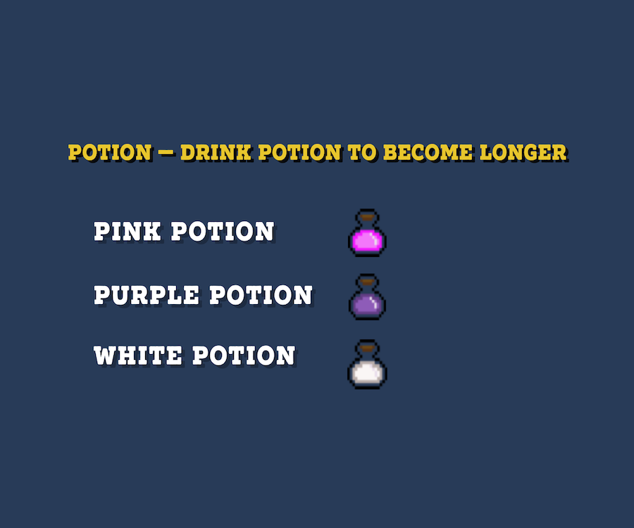
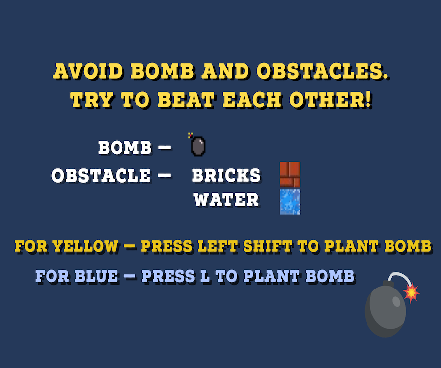

# A CNAKE

A final project for IM1003 Programming Design at National Taiwan University. 

**The source codes of the projects are stored in the folder `src`**.  

The entire project requires `SFML` to build this game. 

The project is built for learning purpose - mainly `C++`, `SFML`, `Game Developing`, `git`. 

## Intro
This game is modified from the traditional snake game. 
- Two players are allowed
- Multi-points in the map
- Bombs can be placed to attack others, including yourself
- Whenever touching a bomb, the length will be cut by 3
- If you run into obstacles or the length become 0, you lose the game
- Fair game happened when you run into the other one by head (both of your lengths are equal) 

## How to Play
Two pre-set snakes are for you and the other person to play:

Instructions:

Demo:  

Demo video on YouTube [here](https://youtu.be/ZDKSKEFhWOg).

## To Do
### Current Version Game (v1.5): 
- [ ] 1. Minor bugs 

### v2 or later: 
- [ ] 1. Settings
   - [ ] 1. sound on/off
   - [ ] 2. speed
- [ ] 2. place bomb, and your lenth will decrease
- [ ] 3. Single player mode
- [ ] 4. connected through server
- [ ] 5. Even more players
- [ ] 6. Shoot from mouth lol
- [ ] 7. Speed up
- [ ] 8. Larger map

## Build
### macOS
Pre-requisite: 
+ SFML
+ Homebrew

If you don't have the above programs loaded on your mac, make sure to download [homebrew](https://brew.sh) first.
Type `/usr/bin/ruby -e "$(curl -fsSL https://raw.githubusercontent.com/Homebrew/install/master/install)"` on your terminal prompt. 

Download **SFML** through terminal: 
Type `brew install SFML`. (If your user setting doesn't fit the system requirement, i.e. your are not the root user, please follow the instruction on your terminal prompt.)

Download this repository

Go to your project directory by typing `cd A-Cnake`, then type in `make`. It will create an extra `obj` folder to store objects created by the system. You may ignore the folder. 

You should be able to run the game by typing `./A\ Cnake`. Or, you can follow the instructions shown on your terminal prompt. 

#### Clean
To clean up the project folder, type `make clean`; such will delete the `obj` folder, but won't erase the `A Cnake` executable. 

To really remove `A Cnake` game from your device, type `make remove`. 

## Archive
- [x] 1. win, lose, 平手, play again windows
    + Add player 1 (blue snake) wins
    + Add player 2 (yellow snake) wins
    + Add Fair play
    + Play again button(?)
- [x] 2. Add sound effects
- [x] 3. Add pause state (no beautiful UI though, the frame will be paused however.)
- [x] 4. Instruction window
- [x] 5. Separate main.cpp into different classes

## Contributors
+ Pony
+ Watermelon Man
+ Brian
+ chihong-j
+ Other resources from the Internet (Mostly from [SFML-dev.org](https://www.sfml-dev.org))

## Credits
Background music:
► Music Credit: SUNDANCE
Track Name: "Perséphone - Retro Funky (SUNDANCE remix)"
Music By: SUNDANCE @ [https://soundcloud.com/sundancemusic](https://soundcloud.com/sundancemusic)
The SUNDANCE Official Website is HERE - [http://lefthandmusic.fr/](http://lefthandmusic.fr/)
Follow SUNDANCE on BandCamp: [https://sundancemusic.bandcamp.com/](https://sundancemusic.bandcamp.com/)
License for commercial use: Creative Commons Attribution 3.0 Unported (CC BY 3.0) [https://creativecommons.org/licenses/](https://creativecommons.org/licenses/)...
Music promoted by NCM [https://goo.gl/fh3rEJ](https://goo.gl/fh3rEJ)
